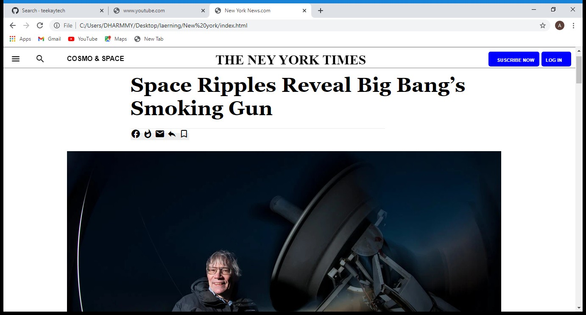
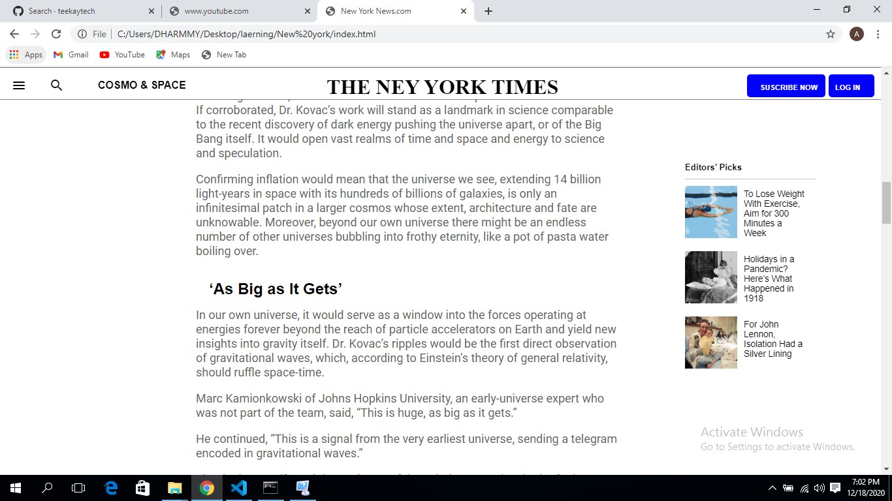

# THE NEWS YORK TIMES

This is a webpage project that focuses on developing a New York Times webpage.
   
 > 

The aim of this project is to develop a webpage similar to The New York Times Newspaper. The contents are personalized and the design specifications were obtained from the ordins project.

## Built with
  * HTML 
  * CSS (Bootstrap)

  

## Live demo
[Live Demo Link](https://rawcdn.githack.com/Temitayo40/New-york/95c9f1eb33ab4fb4577b9954b769f85c1488e3c3/index.html)

## Getting started
* I created a website cloned from New York Times. The design specifications were gotten from [ordinproject.com](https://www.ordinsproject.com). The project consist of one working pages (including navigation bar, body and footer) with a display of system view
 
 * To get a local copy up and running follow these simple steps.

 * On the project GitHub page
 * navigate to the main page of the repository this page.
 * Under the repository name, locate and click on a green button named 'Code'.
 * Copy the project URL as displayed.
 * If you're running Windows Operating System, open your command prompt. On Linux,
   Open your terminal.
* Change the current working directory to the location where you want the cloned directory to be made. 
* Leave as it is if the current location is where you want the project to be.
* Type git clone, and then paste the URL you copied in Step 3.
$ git clone https://github.com/Temitayo40/New-york
Press Enter. Your local copy will be created.
  
Please Note that you must have github installed on your PC, this can be done here.**

## Authors
 **Author:**
 * Name: Adebowale Damilola
 * [Github](https://github.com/Temitayo40/)
 * [Twitter](https://twitter.com/Adebowa30361993)

## Show your support
Give a :star: if you like this project!

## Acknowledgements

  * [The Odin Project](https://www.theodinproject.com/courses/html5-and-css3/lessons/embedding-images-and-video#introduction)
 

## License
 Distributed under the MIT License.